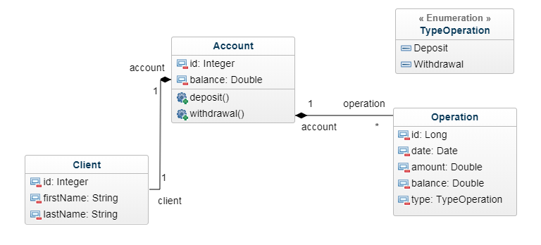

# Documentation of Bank Account Application

This project is developed in a complete stack.
The backend is developed in Java using Spring and Hibernate Frameworks.
Front-end is developed in TypeScript using Angular 4 Framework.

## The class diagram

- A customer has a single account
- An account has multiple operations



## The senario for this application:

It is assumed that the clients and accounts are already created.

The client can do the following actions :

- Go to the homepage.
- chooses his account.
- deposit an amount on his account.
- withdraw the amount if it is less than his balance
- view the operations

## Prerequisites
 
1. [Node.js](https://github.com/nodejs/node) 
and [npm](https://github.com/npm/npm) 

2. [Angular CLI](https://github.com/angular/angular-cli) 

 How to install if it is not already on your machine

```bash
npm install -g @angular/cli
```

3. [Maven](https://github.com/apache/maven)
  
4. Java 


## Run Back End Application

Run Spring Booot application 

```bash
java -jar Bank-1.0-SNAPSHOT.jar
```
Navigate to `http://localhost:8090/accounts`

## Run Front End Application

1. First Run java application for Rest api

2. Run Angular Application

```bash
cd bank-app
ng serve
```
Navigate to `http://localhost:4200/`.


